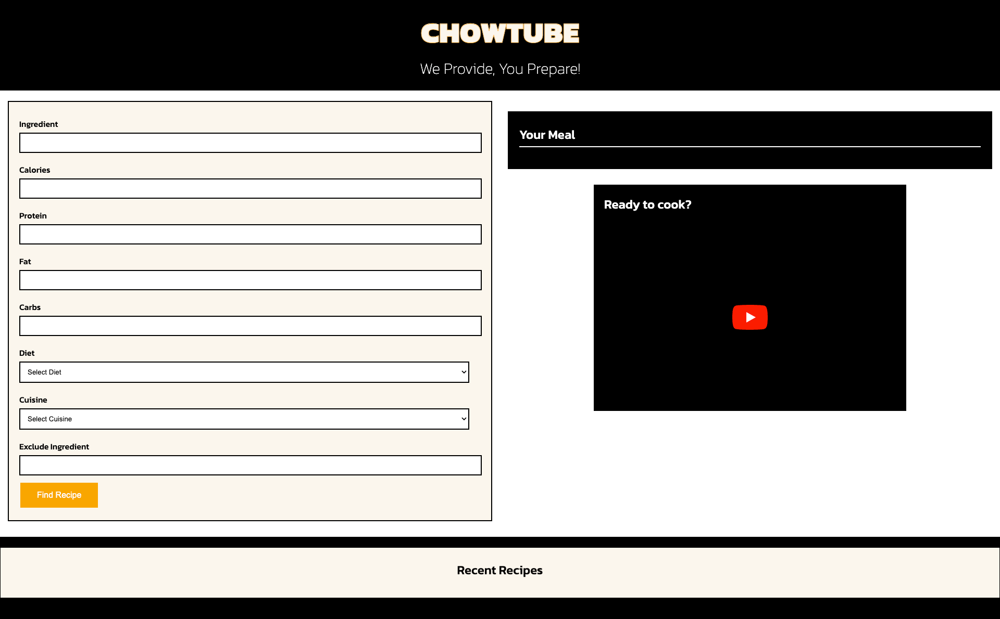
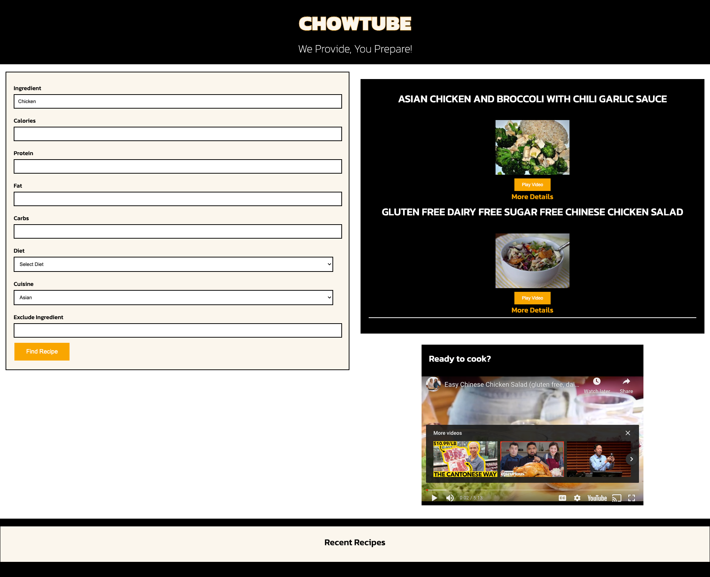
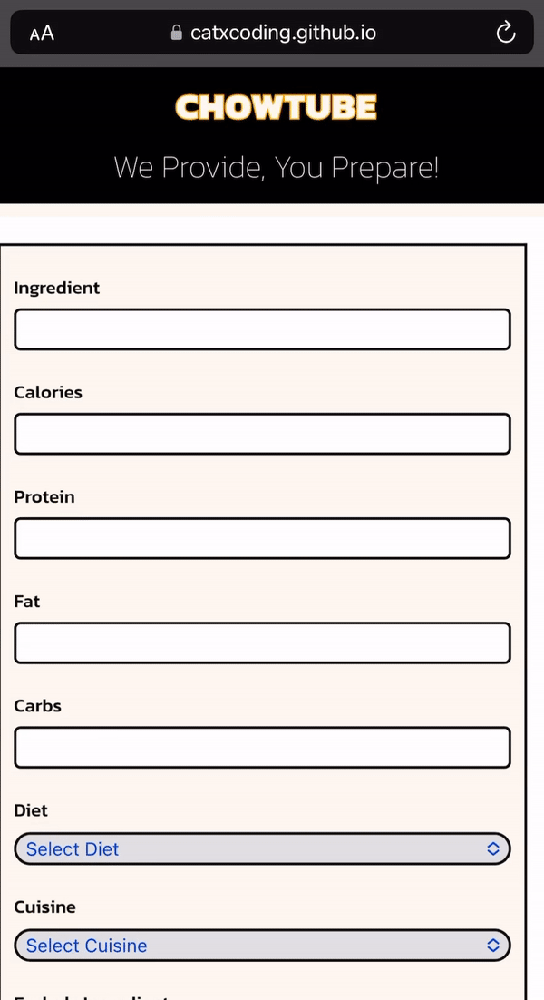

# CHOWTUBE
07 Project by Cat Thompson, Alex Sierra and Jared Eichhorst

# Meal Search Website

This project is a meal search website where users can input their nutritional data and dietary restrictions to find meal options. Additionally, users can watch YouTube videos for the selected meals or recipes.

## User Story

As a health-conscious food enthusiast, I want to find meal options that meet my nutritional requirements and dietary restrictions. I also want the option to watch a YouTube video of the meal or recipe to learn how to prepare it.

## Features

- **Nutritional Data Entry:** Users can input their nutritional data, including calories, and specific ingredients to include or exclude from their meal options.
- **Dietary Restrictions:** Users can specify dietary restrictions such as vegetarian, vegan, gluten-free to filter meal options.
- **Search and Recommendations:** After inputting data, the system provides a meal recommendations meeting the criteria.
- **Meal Details:** Detailed information about each meal, including nutritional content and ingredients
- **YouTube Video Integration:** Users can watch a YouTube video tutorial or recipe demonstration for the meal.
- **View Recent Recipes:** Users can see meals they have watched/searched.

## Completed Taks

- Uses CSS Framework
- Deployed to Git Hub
- Interactive User Input
- Uses Two Server-Side APIs: Spoonaculat and Youtube
- Uses Client Side Storage (Recently Viewed Recipes)
- Responsive to differnt size screens and devices
- Clean Repository
- 

## Technologies and Resources Used
- Frontend (HTML, CSS, Javascript)
- YouTube API for video integration
- Spoonacular API for recipe intergration
- Chat GBT assisted in README and User Story
- W3Schools + MDN

## Contribution
- Cat Thompson (catxcoding)
- Alex Sierra (asierra619)
- Jared Eichhorst (jarede712)

## License
- MIT 

## Links and Photos

[Deployed Website](https://catxcoding.github.io/chowtube/)---
[Repository](https://github.com/catxcoding/chowtube)---

